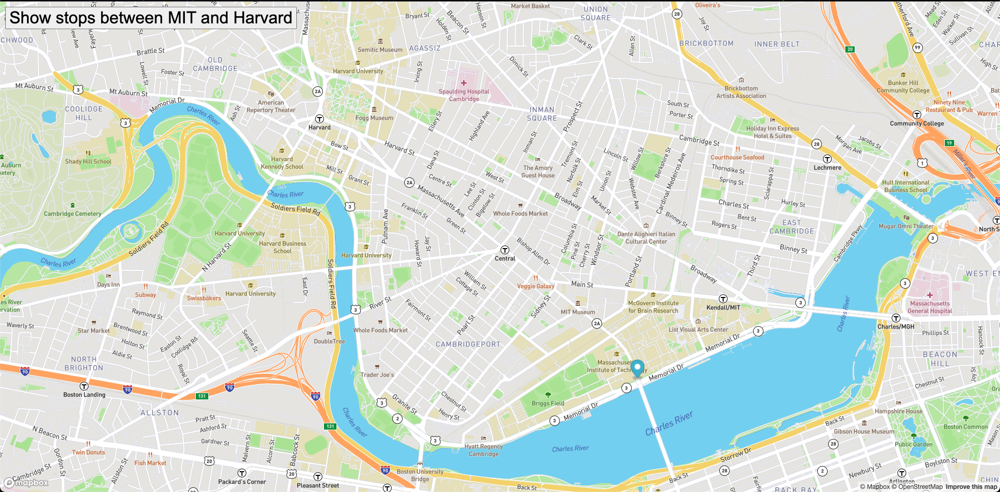

# Real Time Bus Tracker

## Description 

This is a week 9 coding project in the MIT xPRO Full Stack Web Development Course. It runs an animation of a marker representing all of the bus stops in between MIT and Harvard.

## Installation

Download the following files:
1. style.css
2. index.html
3. mapanimation.js

## Roadmap
In the future, I'd like to revisit this and restructure it to follow a Chicago Public Transit route. I will apply for an API key for access through the Chicago Developers database.

## License
MIT xPRO - For educational purposes only.

